# Design Patterns — Guida Completa (Gang of Four)

> I Design Pattern sono **soluzioni riutilizzabili** a problemi ricorrenti di progettazione del software.  
> Catalogati da Gamma, Helm, Johnson, Vlissides — *"Design Patterns: Elements of Reusable Object-Oriented Software"* (1994), aka **Gang of Four (GoF)**.

> **Come leggere i diagrammi:** I diagrammi sono in sintassi **Mermaid** e si renderizzano in VS Code (estensione *Markdown Preview Mermaid Support*), GitHub, Obsidian, Typora e molti altri editor moderni.

---

## Indice

**Creazionali:** [Factory Method](#1-factory-method) · [Abstract Factory](#2-abstract-factory) · [Builder](#3-builder) · [Prototype](#4-prototype) · [Singleton](#5-singleton)

**Strutturali:** [Adapter Classe](#6-adapter--variante-classe) · [Adapter Oggetto](#7-adapter--variante-oggetto) · [Bridge](#8-bridge) · [Composite](#9-composite) · [Decorator](#10-decorator) · [Facade](#11-facade) · [Proxy](#12-proxy)

**Comportamentali:** [Interpreter](#13-interpreter) · [Template Method](#14-template-method) · [Chain of Responsibility](#15-chain-of-responsibility) · [Command](#16-command) · [Iterator](#17-iterator) · [Mediator](#18-mediator) · [Memento](#19-memento) · [Flyweight](#20-flyweight) · [Observer](#21-observer) · [State](#22-state) · [Strategy](#23-strategy) · [Visitor](#24-visitor)

**Appendice:** [Mappa Relazioni](#mappa-delle-relazioni-tra-pattern) · [Tabella Riassuntiva](#tabella-riassuntiva)

---

## PATTERN CREAZIONALI

> Gestiscono **come vengono creati** gli oggetti, nascondendo la logica di istanziazione.

---

### 1. Factory Method

**Categoria:** Creazionale — Classe  
**Intento:** Definisce un'interfaccia per creare un oggetto, ma lascia alle **sottoclassi** decidere quale classe istanziare.

#### Cos'è e a cosa serve

Il Creator astratto conosce *quando* creare un oggetto ma non *quale* tipo — quella decisione spetta alla sottoclasse che sovrascrive il factory method.

**Quando usarlo:** non sai il tipo esatto a compile-time; vuoi che le sottoclassi decidano; vuoi separare codice di creazione da codice di utilizzo.

#### Spiegazione per principianti

Una catena di pizzerie ha la procedura standard (*prepara → cuoci → consegna*), ma ogni franchising usa la propria ricetta. Il processo è fisso — cambia solo **chi prepara** la pizza.

#### Diagramma UML

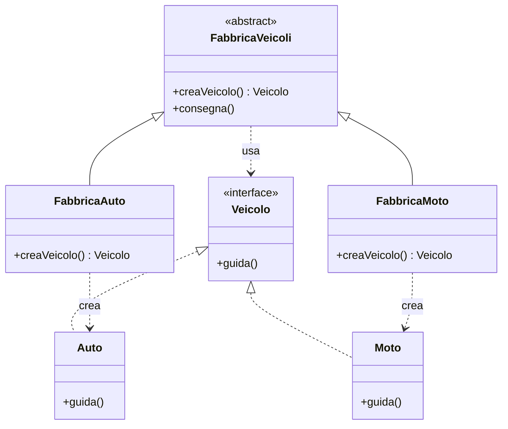
```mermaid
classDiagram
    class FabbricaVeicoli {
        <<abstract>>
        +creaVeicolo() Veicolo
        +consegna()
    }
    class FabbricaAuto {
        +creaVeicolo() Veicolo
    }
    class FabbricaMoto {
        +creaVeicolo() Veicolo
    }
    class Veicolo {
        <<interface>>
        +guida()
    }
    class Auto {
        +guida()
    }
    class Moto {
        +guida()
    }
    FabbricaVeicoli <|-- FabbricaAuto
    FabbricaVeicoli <|-- FabbricaMoto
    Veicolo <|.. Auto
    Veicolo <|.. Moto
    FabbricaVeicoli ..> Veicolo : usa
    FabbricaAuto ..> Auto : crea
    FabbricaMoto ..> Moto : crea
```

#### Esempio Java

```java
interface Veicolo { void guida(); }

class Auto implements Veicolo {
    public void guida() { System.out.println("Guido un'auto"); }
}
class Moto implements Veicolo {
    public void guida() { System.out.println("Guido una moto"); }
}

abstract class FabbricaVeicoli {
    public abstract Veicolo creaVeicolo(); // Factory Method

    public void consegna() {
        Veicolo v = creaVeicolo();
        v.guida();
    }
}

class FabbricaAuto extends FabbricaVeicoli {
    public Veicolo creaVeicolo() { return new Auto(); }
}
class FabbricaMoto extends FabbricaVeicoli {
    public Veicolo creaVeicolo() { return new Moto(); }
}

// Uso
FabbricaVeicoli f = new FabbricaAuto();
f.consegna(); // "Guido un'auto"
```

#### Pro / Contro

| PRO | CONTRO |
|-----|--------|
| Rispetta Open/Closed | Proliferazione di sottoclassi |
| Rispetta Single Responsibility | Più complesso della new diretta |
| Disaccoppia creator dal prodotto concreto | |

#### Relazioni con altri pattern

- **→ Abstract Factory** quando servono famiglie di prodotti correlati
- **È usato da Abstract Factory** internamente
- **È un caso speciale di Template Method** applicato alla creazione
- **→ Singleton** — i factory method sono spesso implementati come Singleton

---

### 2. Abstract Factory

**Categoria:** Creazionale — Oggetto  
**Intento:** Fornisce un'interfaccia per creare **famiglie di oggetti correlati** senza specificare le loro classi concrete.

#### Cos'è e a cosa serve

Una "super-fabbrica" che produce più prodotti garantendone la compatibilità reciproca. Il client usa solo le interfacce astratte.

**Quando usarlo:** vuoi garantire che prodotti di una famiglia vengano usati insieme; vuoi poter scambiare intere famiglie (es. tema chiaro/scuro).

#### Spiegazione per principianti

Un negozio di mobili: acquisti stile *Moderno* (divano + tavolo + lampada moderni) o stile *Vittoriano*. L'Abstract Factory garantisce di non mischiare stili diversi.

#### Diagramma UML

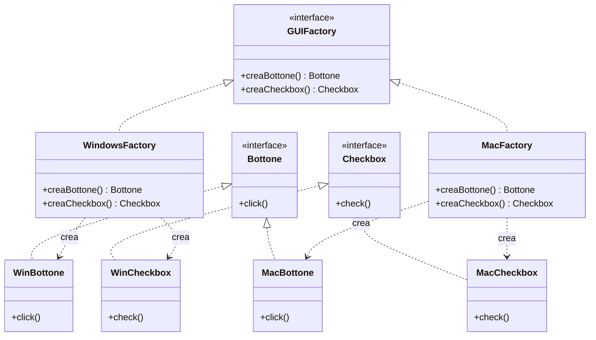
```mermaid
classDiagram
    class GUIFactory {
        <<interface>>
        +creaBottone() Bottone
        +creaCheckbox() Checkbox
    }
    class WindowsFactory {
        +creaBottone() Bottone
        +creaCheckbox() Checkbox
    }
    class MacFactory {
        +creaBottone() Bottone
        +creaCheckbox() Checkbox
    }
    class Bottone {
        <<interface>>
        +click()
    }
    class Checkbox {
        <<interface>>
        +check()
    }
    class WinBottone { +click() }
    class WinCheckbox { +check() }
    class MacBottone { +click() }
    class MacCheckbox { +check() }

    GUIFactory <|.. WindowsFactory
    GUIFactory <|.. MacFactory
    Bottone <|.. WinBottone
    Bottone <|.. MacBottone
    Checkbox <|.. WinCheckbox
    Checkbox <|.. MacCheckbox
    WindowsFactory ..> WinBottone : crea
    WindowsFactory ..> WinCheckbox : crea
    MacFactory ..> MacBottone : crea
    MacFactory ..> MacCheckbox : crea
```

#### Esempio Java

```java
interface Bottone  { void click(); }
interface Checkbox { void check(); }

class WinBottone  implements Bottone  { public void click() { System.out.println("Win button"); } }
class WinCheckbox implements Checkbox { public void check() { System.out.println("Win checkbox"); } }
class MacBottone  implements Bottone  { public void click() { System.out.println("Mac button"); } }
class MacCheckbox implements Checkbox { public void check() { System.out.println("Mac checkbox"); } }

interface GUIFactory {
    Bottone  creaBottone();
    Checkbox creaCheckbox();
}
class WindowsFactory implements GUIFactory {
    public Bottone  creaBottone()  { return new WinBottone(); }
    public Checkbox creaCheckbox() { return new WinCheckbox(); }
}
class MacFactory implements GUIFactory {
    public Bottone  creaBottone()  { return new MacBottone(); }
    public Checkbox creaCheckbox() { return new MacCheckbox(); }
}

// Client — ignora le classi concrete
class Application {
    private final Bottone b; private final Checkbox c;
    Application(GUIFactory f) { b = f.creaBottone(); c = f.creaCheckbox(); }
    void render() { b.click(); c.check(); }
}

// Uso — basta cambiare questa riga
new Application(new WindowsFactory()).render();
```

#### Pro / Contro

| PRO | CONTRO |
|-----|--------|
| Garantisce compatibilità tra prodotti della stessa famiglia | Aggiungere un nuovo tipo di prodotto richiede modifiche all'intera interfaccia |
| Scambio facile di famiglie | Struttura più complessa di Factory Method |

#### Relazioni con altri pattern

- **← Factory Method** — ne è una generalizzazione; usa Factory Method internamente
- **→ Singleton** — le factory concrete sono spesso Singleton
- **Con Prototype** — può usare Prototype per creare i prodotti tramite clonazione

---

### 3. Builder

**Categoria:** Creazionale — Oggetto  
**Intento:** Separa la **costruzione** di un oggetto complesso dalla sua **rappresentazione**.

#### Cos'è e a cosa serve

Builder costruisce un oggetto passo dopo passo tramite un'interfaccia fluente. Il *Director* conosce l'ordine dei passi; il *Builder* sa come eseguirli.

**Quando usarlo:** oggetto con molti parametri opzionali; vuoi evitare il "telescoping constructor"; vuoi diverse rappresentazioni dello stesso tipo.

#### Spiegazione per principianti

Ordini un hamburger: scegli il pane, poi la carne, poi le verdure. Ogni passo aggiunge un componente. Alla fine chiami *"costruisci!"*. Il barista (Director) sa l'ordine; il cuoco (Builder) sa come preparare ogni pezzo.

#### Diagramma UML

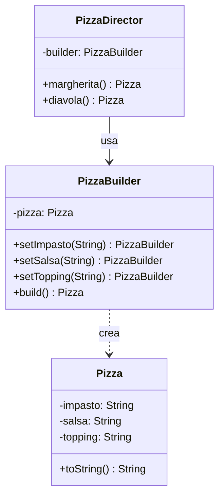
```mermaid
classDiagram
    class PizzaDirector {
        -builder: PizzaBuilder
        +margherita() Pizza
        +diavola() Pizza
    }
    class PizzaBuilder {
        -pizza: Pizza
        +setImpasto(String) PizzaBuilder
        +setSalsa(String) PizzaBuilder
        +setTopping(String) PizzaBuilder
        +build() Pizza
    }
    class Pizza {
        -impasto: String
        -salsa: String
        -topping: String
        +toString() String
    }
    PizzaDirector --> PizzaBuilder : usa
    PizzaBuilder ..> Pizza : crea
```

#### Esempio Java

```java
class Pizza {
    private String impasto, salsa, topping;
    void setImpasto(String i) { impasto = i; }
    void setSalsa(String s)   { salsa = s; }
    void setTopping(String t) { topping = t; }
    public String toString()  { return "Pizza ["+impasto+"|"+salsa+"|"+topping+"]"; }
}

class PizzaBuilder {
    private Pizza pizza = new Pizza();
    public PizzaBuilder setImpasto(String i) { pizza.setImpasto(i); return this; }
    public PizzaBuilder setSalsa(String s)   { pizza.setSalsa(s);   return this; }
    public PizzaBuilder setTopping(String t) { pizza.setTopping(t); return this; }
    public Pizza build() { return pizza; }
}

// Uso fluent (senza Director)
Pizza p = new PizzaBuilder()
    .setImpasto("sottile")
    .setSalsa("pomodoro")
    .setTopping("mozzarella")
    .build();
System.out.println(p); // Pizza [sottile|pomodoro|mozzarella]
```

#### Pro / Contro

| PRO | CONTRO |
|-----|--------|
| Costruisce oggetti complessi passo dopo passo | Più classi rispetto alla new diretta |
| Elimina il telescoping constructor | Eccessivo per oggetti semplici |
| Stesso processo → rappresentazioni diverse | |

#### Relazioni con altri pattern

- **vs Abstract Factory** — Builder = un oggetto complesso passo per passo; AF = famiglie di oggetti in un passo
- **Director come Facade** — nasconde la complessità del processo di costruzione
- **Con Composite** — spesso usato per costruire alberi Composite

---

### 4. Prototype

**Categoria:** Creazionale — Oggetto  
**Intento:** Crea nuovi oggetti **clonando** un'istanza prototipale esistente.

#### Cos'è e a cosa serve

Invece di creare da zero, si clona un oggetto esistente. Utile quando la creazione è costosa o si vogliono oggetti simili con piccole variazioni.

**Quando usarlo:** creare da zero è costoso; vuoi oggetti simili ma non identici; non vuoi dipendere dalle classi concrete.

#### Spiegazione per principianti

Hai un documento Word complesso. Invece di rifarlo da zero, fai *Copia* e modifichi solo le parti che cambiano. Il documento originale è il **prototipo**.

#### Diagramma UML

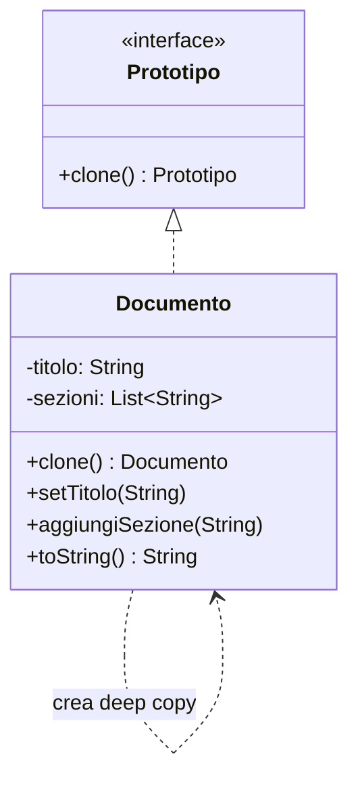
```mermaid
classDiagram
    class Prototipo {
        <<interface>>
        +clone() Prototipo
    }
    class Documento {
        -titolo: String
        -sezioni: List~String~
        +clone() Documento
        +setTitolo(String)
        +aggiungiSezione(String)
        +toString() String
    }
    Prototipo <|.. Documento
    Documento ..> Documento : crea deep copy
```

#### Esempio Java

```java
interface Prototipo { Prototipo clone(); }

class Documento implements Prototipo {
    private String titolo;
    private List<String> sezioni;

    public Documento(String titolo, List<String> sezioni) {
        this.titolo = titolo;
        this.sezioni = new ArrayList<>(sezioni);
    }
    // Copy constructor per la deep copy
    private Documento(Documento altro) {
        this.titolo  = altro.titolo;
        this.sezioni = new ArrayList<>(altro.sezioni); // deep copy!
    }

    @Override public Documento clone() { return new Documento(this); }
    public void setTitolo(String t)     { titolo = t; }
    public String toString()            { return titolo + " -> " + sezioni; }
}

// Uso
Documento orig = new Documento("Report Q1", Arrays.asList("Intro","Dati","Fine"));
Documento copia = orig.clone();
copia.setTitolo("Report Q2");

System.out.println(orig);  // Report Q1 -> [Intro, Dati, Fine]
System.out.println(copia); // Report Q2 -> [Intro, Dati, Fine]
```

#### Pro / Contro

| PRO | CONTRO |
|-----|--------|
| Clonare è spesso più efficiente della creazione da zero | Deep copy con riferimenti circolari è complessa |
| Non dipende dalle classi concrete | Il metodo clone() di Java ha problemi storici |

#### Relazioni con altri pattern

- **vs Abstract Factory** — AF crea nuovi oggetti; Prototype clona quelli esistenti
- **Con Abstract Factory** — la factory può mantenere un registro di prototipi da clonare
- **Alternativa a Factory Method** — quando non vuoi creare sottoclassi del creator

---

### 5. Singleton

**Categoria:** Creazionale — Oggetto  
**Intento:** Garantisce che una classe abbia **una sola istanza** e fornisce un punto di accesso globale.

#### Cos'è e a cosa serve

Costruttore privato + metodo statico `getInstance()` che crea l'istanza solo la prima volta.

**Quando usarlo:** risorsa condivisa unica (logger, config, connection pool).

#### Spiegazione per principianti

Il Presidente di un paese: ce n'è sempre uno solo. Chiunque voglia comunicare con lui accede sempre alla stessa persona. Il costruttore privato impedisce di "creare" un secondo Presidente.

#### Diagramma UML

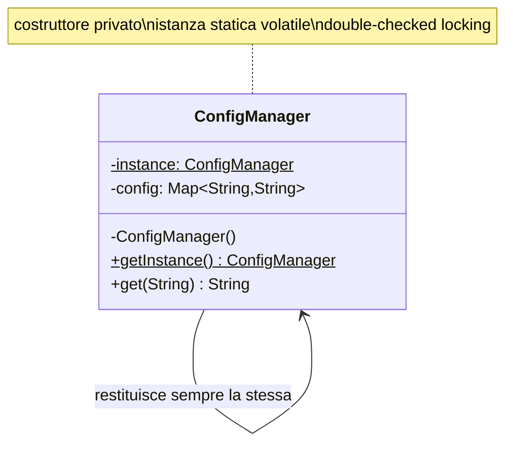
```mermaid
classDiagram
    class ConfigManager {
        -instance: ConfigManager$
        -config: Map~String,String~
        -ConfigManager()
        +getInstance()$ ConfigManager
        +get(String) String
    }
    note for ConfigManager "costruttore privato\nistanza statica volatile\ndouble-checked locking"
    ConfigManager --> ConfigManager : restituisce sempre la stessa
```

#### Esempio Java

```java
public class ConfigManager {
    private static volatile ConfigManager instance;
    private final Map<String, String> config = new HashMap<>();

    private ConfigManager() {               // nessuno può fare new ConfigManager()
        config.put("db.host", "localhost");
        config.put("db.port", "5432");
    }

    public static ConfigManager getInstance() {
        if (instance == null) {
            synchronized (ConfigManager.class) {
                if (instance == null) instance = new ConfigManager(); // double-checked
            }
        }
        return instance;
    }
    public String get(String key) { return config.get(key); }
}

// Alternativa moderna: Enum Singleton (thread-safe, serialization-safe)
public enum AppConfig {
    INSTANCE;
    public String get(String key) { return "..."; }
}

// Uso
ConfigManager a = ConfigManager.getInstance();
ConfigManager b = ConfigManager.getInstance();
System.out.println(a == b); // true — stessa istanza
```

#### Pro / Contro

| PRO | CONTRO |
|-----|--------|
| Garantisce una sola istanza | Viola Single Responsibility |
| Lazy initialization | Stato globale → testing difficile |
| Accesso globale | Considerato anti-pattern se abusato |

#### Relazioni con altri pattern

- **Usato da** Abstract Factory, Builder, Facade (spesso implementati come Singleton)
- **vs Dependency Injection** — nei framework moderni (Spring) preferisci DI al Singleton manuale
- **vs Flyweight** — Flyweight = poche istanze (una per tipo); Singleton = esattamente una

---

## PATTERN STRUTTURALI

> Gestiscono **come si compongono** classi e oggetti per formare strutture più grandi.

---

### 6. Adapter — Variante Classe

**Categoria:** Strutturale — Classe  
**Intento:** Converte l'interfaccia di una classe in un'altra tramite **ereditarietà**.

#### Spiegazione per principianti

Spina americana (3 pin) in una presa europea (2 pin): l'adattatore fisico traduce il formato. Qui l'Adapter *è* sia il Target che l'Adaptee (ereditarietà multipla).

#### Diagramma UML

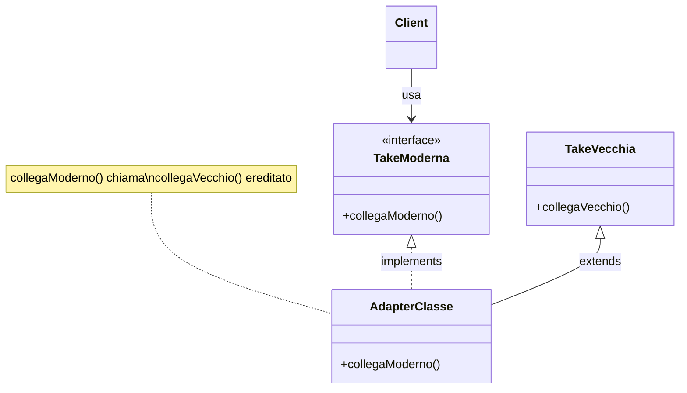
```mermaid
classDiagram
    class TakeModerna {
        <<interface>>
        +collegaModerno()
    }
    class TakeVecchia {
        +collegaVecchio()
    }
    class AdapterClasse {
        +collegaModerno()
    }
    class Client
    TakeModerna <|.. AdapterClasse : implements
    TakeVecchia <|-- AdapterClasse : extends
    Client --> TakeModerna : usa
    note for AdapterClasse "collegaModerno() chiama\ncollegaVecchio() ereditato"
```

#### Esempio Java

```java
interface TakeModerna { void collegaModerno(); }

class TakeVecchia {
    public void collegaVecchio() { System.out.println("Connesso (vecchio)"); }
}

// Adapter CLASSE: eredita TakeVecchia + implementa TakeModerna
class AdapterClasse extends TakeVecchia implements TakeModerna {
    @Override
    public void collegaModerno() { collegaVecchio(); } // traduce
}

TakeModerna presa = new AdapterClasse();
presa.collegaModerno();
```

#### Pro / Contro

| PRO | CONTRO |
|-----|--------|
| Semplice, nessun overhead | Vincola ereditarietà → meno flessibile |
| | Non adatta sottoclassi dell'Adaptee |

---

### 7. Adapter — Variante Oggetto

**Categoria:** Strutturale — Oggetto  
**Intento:** Converte l'interfaccia di una classe tramite **composizione** (preferita in Java).

#### Diagramma UML

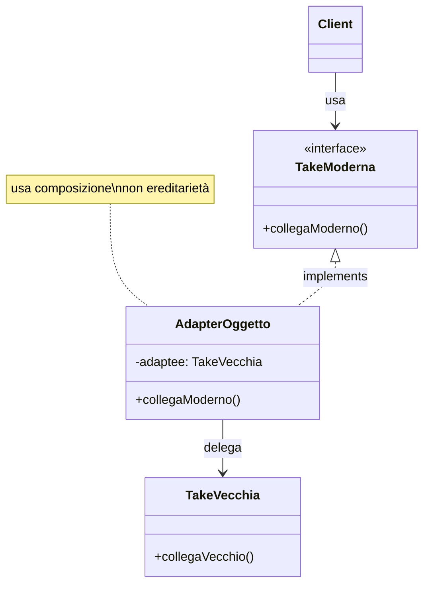
```mermaid
classDiagram
    class TakeModerna {
        <<interface>>
        +collegaModerno()
    }
    class TakeVecchia {
        +collegaVecchio()
    }
    class AdapterOggetto {
        -adaptee: TakeVecchia
        +collegaModerno()
    }
    class Client
    TakeModerna <|.. AdapterOggetto : implements
    AdapterOggetto --> TakeVecchia : delega
    Client --> TakeModerna : usa
    note for AdapterOggetto "usa composizione\nnon ereditarietà"
```

#### Esempio Java

```java
class AdapterOggetto implements TakeModerna {
    private final TakeVecchia adaptee;
    public AdapterOggetto(TakeVecchia a) { adaptee = a; }

    @Override
    public void collegaModerno() { adaptee.collegaVecchio(); }
}

// Può adattare anche sottoclassi di TakeVecchia
TakeModerna adapter = new AdapterOggetto(new TakeVecchia());
adapter.collegaModerno();
```

#### Pro / Contro

| PRO | CONTRO |
|-----|--------|
| Più flessibile (nessun vincolo ereditarietà) | Un livello di indirezione in più |
| Adatta anche sottoclassi dell'Adaptee | |
| **Preferita in Java** | |

#### Relazioni con altri pattern (entrambe le varianti)

- **vs Bridge** — Bridge è *by-design*; Adapter è retrofitting su codice esistente
- **vs Decorator** — Decorator mantiene l'interfaccia; Adapter la *cambia*
- **vs Proxy** — Proxy mantiene l'interfaccia; Adapter la *cambia*
- **vs Facade** — Facade crea un'interfaccia semplificata nuova; Adapter fa corrispondere due esistenti

---

### 8. Bridge

**Categoria:** Strutturale — Oggetto  
**Intento:** Separa **astrazione** da **implementazione** in modo che le due possano variare indipendentemente.

#### Cos'è e a cosa serve

Evita l'esplosione combinatoria di sottoclassi. Con N astrazioni e M implementazioni, senza Bridge servono N×M classi; con Bridge bastano N+M.

#### Spiegazione per principianti

2 tipi di telecomando × 3 marche TV = 6 classi senza Bridge, solo 5 con Bridge. Con 10 TV: 20 vs 12. Il "ponte" è il riferimento che l'astrazione mantiene verso l'implementazione.

#### Diagramma UML

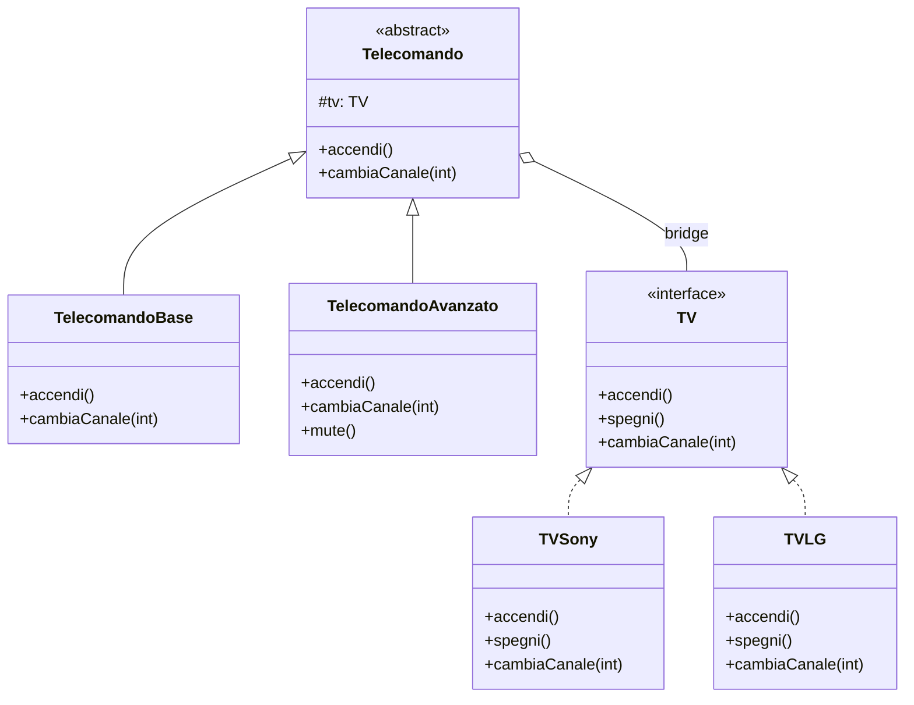
```mermaid
classDiagram
    class Telecomando {
        <<abstract>>
        #tv: TV
        +accendi()
        +cambiaCanale(int)
    }
    class TelecomandoBase {
        +accendi()
        +cambiaCanale(int)
    }
    class TelecomandoAvanzato {
        +accendi()
        +cambiaCanale(int)
        +mute()
    }
    class TV {
        <<interface>>
        +accendi()
        +spegni()
        +cambiaCanale(int)
    }
    class TVSony {
        +accendi()
        +spegni()
        +cambiaCanale(int)
    }
    class TVLG {
        +accendi()
        +spegni()
        +cambiaCanale(int)
    }
    Telecomando <|-- TelecomandoBase
    Telecomando <|-- TelecomandoAvanzato
    TV <|.. TVSony
    TV <|.. TVLG
    Telecomando o-- TV : bridge
```

#### Esempio Java

```java
interface TV {
    void accendi(); void spegni(); void cambiaCanale(int c);
}
class TVSony implements TV {
    public void accendi()           { System.out.println("Sony ON"); }
    public void spegni()            { System.out.println("Sony OFF"); }
    public void cambiaCanale(int c) { System.out.println("Sony ch" + c); }
}
class TVLG implements TV {
    public void accendi()           { System.out.println("LG ON"); }
    public void spegni()            { System.out.println("LG OFF"); }
    public void cambiaCanale(int c) { System.out.println("LG ch" + c); }
}

abstract class Telecomando {
    protected TV tv;
    Telecomando(TV tv) { this.tv = tv; }
    public abstract void accendi();
    public abstract void cambiaCanale(int c);
}
class TelecomandoBase extends Telecomando {
    TelecomandoBase(TV tv) { super(tv); }
    public void accendi()           { tv.accendi(); }
    public void cambiaCanale(int c) { tv.cambiaCanale(c); }
}
class TelecomandoAvanzato extends Telecomando {
    TelecomandoAvanzato(TV tv) { super(tv); }
    public void accendi()           { tv.accendi(); System.out.println("[Avanzato]"); }
    public void cambiaCanale(int c) { tv.cambiaCanale(c); }
    public void mute()              { System.out.println("Muto"); }
}

// Combina liberamente: 2 telecomandi × qualsiasi TV
Telecomando t = new TelecomandoAvanzato(new TVSony());
t.accendi(); // "Sony ON", "[Avanzato]"
t.tv = new TVLG(); // cambio implementazione a runtime!
t.accendi(); // "LG ON", "[Avanzato]"
```

#### Pro / Contro

| PRO | CONTRO |
|-----|--------|
| Evita esplosione di sottoclassi (N+M invece di N×M) | Più complesso su problemi semplici |
| Cambio implementazione a runtime | |
| Open/Closed in entrambe le dimensioni | |

#### Relazioni con altri pattern

- **vs Adapter** — Bridge è by-design; Adapter è retrofitting
- **vs Strategy** — Strategy sceglie un algoritmo; Bridge separa astrazione da implementazione
- **Con Abstract Factory** — la factory crea le implementazioni concrete del Bridge

---

### 9. Composite

**Categoria:** Strutturale — Oggetto  
**Intento:** Compone oggetti in strutture **ad albero** (parte-tutto). Il client tratta oggetti singoli e compositi **in modo uniforme**.

#### Spiegazione per principianti

Filesystem: le *cartelle* contengono file e altre cartelle; i *file* sono le foglie. Chiedi la dimensione di una cartella → ricevi ricorsivamente la somma di tutto il contenuto. File e cartelle rispondono entrambi a `getDimensione()`.

#### Diagramma UML

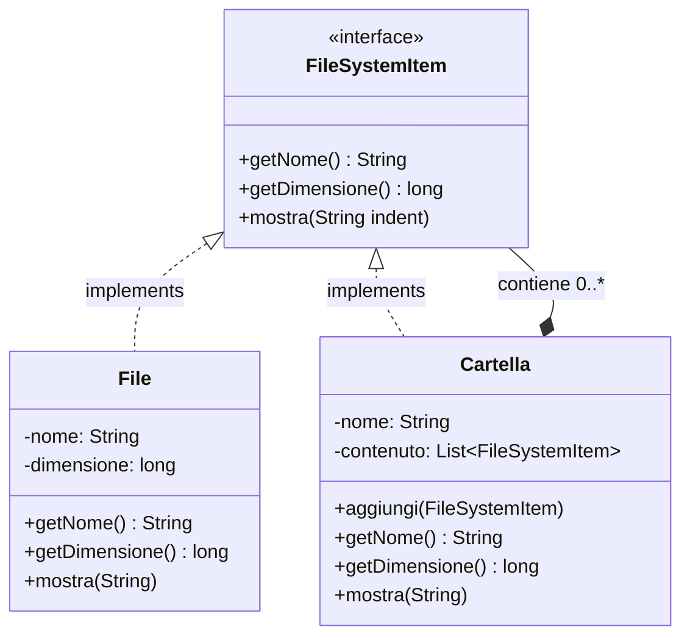
```mermaid
classDiagram
    class FileSystemItem {
        <<interface>>
        +getNome() String
        +getDimensione() long
        +mostra(String indent)
    }
    class File {
        -nome: String
        -dimensione: long
        +getNome() String
        +getDimensione() long
        +mostra(String)
    }
    class Cartella {
        -nome: String
        -contenuto: List~FileSystemItem~
        +aggiungi(FileSystemItem)
        +getNome() String
        +getDimensione() long
        +mostra(String)
    }
    FileSystemItem <|.. File : implements
    FileSystemItem <|.. Cartella : implements
    Cartella *-- FileSystemItem : contiene 0..*
```

#### Esempio Java

```java
interface FileSystemItem {
    String getNome(); long getDimensione(); void mostra(String indent);
}

class File implements FileSystemItem {
    private final String nome; private final long dim;
    File(String nome, long dim) { this.nome = nome; this.dim = dim; }
    public String getNome()         { return nome; }
    public long   getDimensione()   { return dim; }
    public void   mostra(String i)  { System.out.println(i + "[F] " + nome + " (" + dim + "B)"); }
}

class Cartella implements FileSystemItem {
    private final String nome;
    private final List<FileSystemItem> contenuto = new ArrayList<>();
    Cartella(String nome) { this.nome = nome; }
    void aggiungi(FileSystemItem item) { contenuto.add(item); }
    public String getNome()        { return nome; }
    public long   getDimensione()  { return contenuto.stream().mapToLong(FileSystemItem::getDimensione).sum(); }
    public void   mostra(String i) {
        System.out.println(i + "[D] " + nome);
        contenuto.forEach(item -> item.mostra(i + "  "));
    }
}

// Uso
Cartella root = new Cartella("root");
Cartella docs = new Cartella("docs");
docs.aggiungi(new File("report.pdf", 1024));
docs.aggiungi(new File("note.txt",    256));
root.aggiungi(docs);
root.aggiungi(new File("readme.md",  512));

root.mostra(""); // stampa l'intero albero
System.out.println("Totale: " + root.getDimensione() + "B"); // 1792B
```

#### Pro / Contro

| PRO | CONTRO |
|-----|--------|
| Trattamento uniforme di foglie e compositi | Difficile imporre restrizioni sulla struttura |
| Open/Closed per nuovi tipi di componenti | Operazioni solo per foglie devono stare nel Component |

#### Relazioni con altri pattern

- **Con Iterator** — per navigare la struttura ad albero
- **Con Visitor** — per eseguire operazioni su tutta la struttura
- **Con Builder** — per costruire alberi Composite
- **Simile a Decorator** — stessa struttura; Composite ha N figli, Decorator sempre 1

---

### 10. Decorator

**Categoria:** Strutturale — Oggetto  
**Intento:** Aggiunge **responsabilità dinamicamente** a un oggetto. Alternativa flessibile all'ereditarietà.

#### Spiegazione per principianti

Caffè base (1€) → decori con latte (+0.50€) → con vaniglia (+0.30€) → con panna (+0.40€). Ogni strato aggiunge qualcosa senza modificare quello precedente. Puoi combinare gli strati come vuoi.

#### Diagramma UML

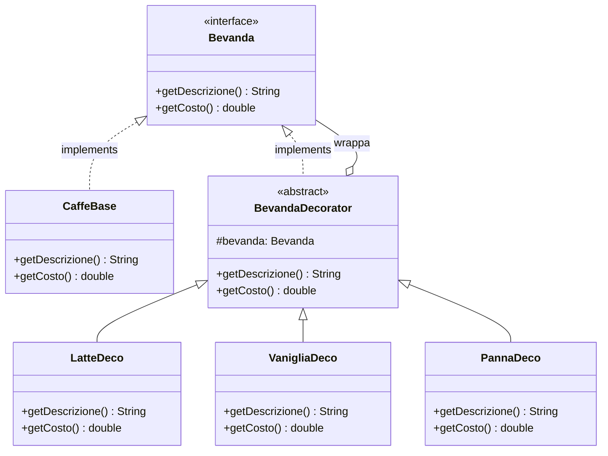
```mermaid
classDiagram
    class Bevanda {
        <<interface>>
        +getDescrizione() String
        +getCosto() double
    }
    class CaffeBase {
        +getDescrizione() String
        +getCosto() double
    }
    class BevandaDecorator {
        <<abstract>>
        #bevanda: Bevanda
        +getDescrizione() String
        +getCosto() double
    }
    class LatteDeco {
        +getDescrizione() String
        +getCosto() double
    }
    class VanigliaDeco {
        +getDescrizione() String
        +getCosto() double
    }
    class PannaDeco {
        +getDescrizione() String
        +getCosto() double
    }
    Bevanda <|.. CaffeBase : implements
    Bevanda <|.. BevandaDecorator : implements
    BevandaDecorator <|-- LatteDeco
    BevandaDecorator <|-- VanigliaDeco
    BevandaDecorator <|-- PannaDeco
    BevandaDecorator o-- Bevanda : wrappa
```

#### Esempio Java

```java
interface Bevanda { String getDescrizione(); double getCosto(); }

class CaffeBase implements Bevanda {
    public String getDescrizione() { return "Caffe'"; }
    public double getCosto()       { return 1.00; }
}

abstract class BevandaDecorator implements Bevanda {
    protected final Bevanda bevanda;
    BevandaDecorator(Bevanda b) { this.bevanda = b; }
}

class LatteDeco extends BevandaDecorator {
    LatteDeco(Bevanda b) { super(b); }
    public String getDescrizione() { return bevanda.getDescrizione() + ", Latte"; }
    public double getCosto()       { return bevanda.getCosto() + 0.50; }
}
class VanigliaDeco extends BevandaDecorator {
    VanigliaDeco(Bevanda b) { super(b); }
    public String getDescrizione() { return bevanda.getDescrizione() + ", Vaniglia"; }
    public double getCosto()       { return bevanda.getCosto() + 0.30; }
}

// Uso: stacking infinito senza nuove classi
Bevanda ordine = new VanigliaDeco(new LatteDeco(new CaffeBase()));
System.out.println(ordine.getDescrizione()); // "Caffe', Latte, Vaniglia"
System.out.printf("%.2f EUR%n", ordine.getCosto()); // 1.80 EUR
```

#### Pro / Contro

| PRO | CONTRO |
|-----|--------|
| Aggiunge/rimuove funzionalità a runtime | L'ordine dei decoratori può influire sul risultato |
| Combinazioni infinite senza classi aggiuntive | Rimuovere un decoratore specifico dalla catena è complicato |
| Rispetta Single Responsibility | |

#### Relazioni con altri pattern

- **vs Composite** — stessa struttura; Composite aggrega N figli, Decorator ne ha sempre 1
- **vs Adapter** — Adapter cambia l'interfaccia; Decorator la mantiene
- **vs Proxy** — stessa struttura; Proxy controlla accesso, Decorator aggiunge funzionalità
- **Java I/O** — `BufferedInputStream(GZIPInputStream(FileInputStream(...)))` è Decorator

---

### 11. Facade

**Categoria:** Strutturale — Oggetto  
**Intento:** Fornisce un'**interfaccia semplificata** a un sottosistema complesso.

#### Spiegazione per principianti

Al ristorante parli solo col cameriere — lui coordina cuoco, sommelier, cassiere. Non sai come è organizzata la cucina. Il cameriere è la Facade.

#### Diagramma UML

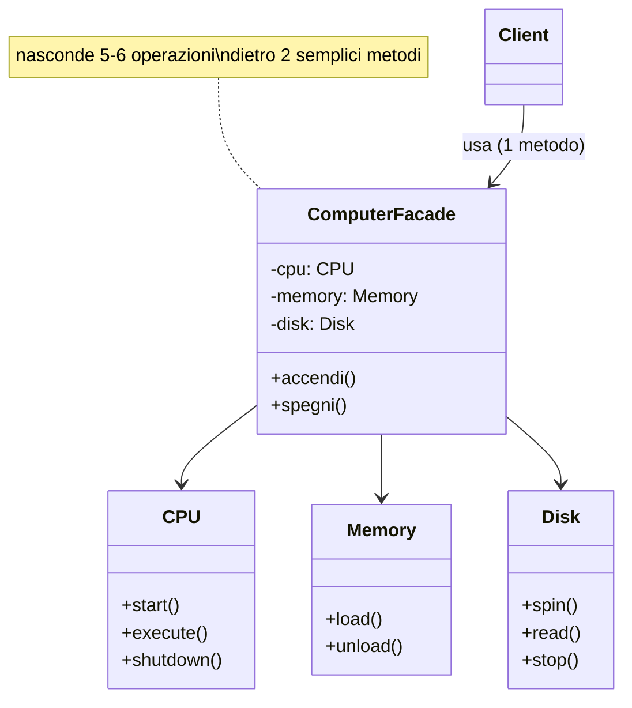
```mermaid
classDiagram
    class Client
    class ComputerFacade {
        -cpu: CPU
        -memory: Memory
        -disk: Disk
        +accendi()
        +spegni()
    }
    class CPU {
        +start()
        +execute()
        +shutdown()
    }
    class Memory {
        +load()
        +unload()
    }
    class Disk {
        +spin()
        +read()
        +stop()
    }
    Client --> ComputerFacade : usa (1 metodo)
    ComputerFacade --> CPU
    ComputerFacade --> Memory
    ComputerFacade --> Disk
    note for ComputerFacade "nasconde 5-6 operazioni\ndietro 2 semplici metodi"
```

#### Esempio Java

```java
class CPU    { void start(){System.out.println("CPU start");} void execute(){System.out.println("CPU exec");} void shutdown(){System.out.println("CPU off");} }
class Memory { void load() {System.out.println("Mem load");} void unload(){System.out.println("Mem unload");} }
class Disk   { void spin() {System.out.println("Disk spin");} void read(){System.out.println("Disk read");} void stop(){System.out.println("Disk stop");} }

class ComputerFacade {
    private final CPU cpu = new CPU(); private final Memory mem = new Memory(); private final Disk disk = new Disk();

    public void accendi() { cpu.start(); mem.load(); disk.spin(); disk.read(); cpu.execute(); }
    public void spegni()  { disk.stop(); mem.unload(); cpu.shutdown(); }
}

// Client: una riga invece di cinque
new ComputerFacade().accendi();
```

#### Pro / Contro

| PRO | CONTRO |
|-----|--------|
| Interfaccia semplice per il client | Può diventare un god object |
| Facilita il refactoring interno | Non impedisce l'accesso diretto al sottosistema |

#### Relazioni con altri pattern

- **vs Adapter** — Adapter fa corrispondere due interfacce; Facade crea un'interfaccia semplificata
- **vs Mediator** — Mediator coordina oggetti pari; Facade semplifica un sottosistema
- **Spesso Singleton** — una sola Facade per sottosistema

---

### 12. Proxy

**Categoria:** Strutturale — Oggetto  
**Intento:** Fornisce un **surrogato** per un altro oggetto, controllando l'accesso ad esso.

#### Tipi principali

- **Virtual Proxy** — lazy loading di oggetti costosi
- **Protection Proxy** — controllo accessi per permessi
- **Remote Proxy** — oggetto remoto (RMI)
- **Caching Proxy** — memorizza risultati

#### Spiegazione per principianti

Carta di credito = proxy del conto bancario. Stessa interfaccia ("paga"), ma la carta verifica limite e sicurezza prima di prelevare dal conto reale.

#### Diagramma UML

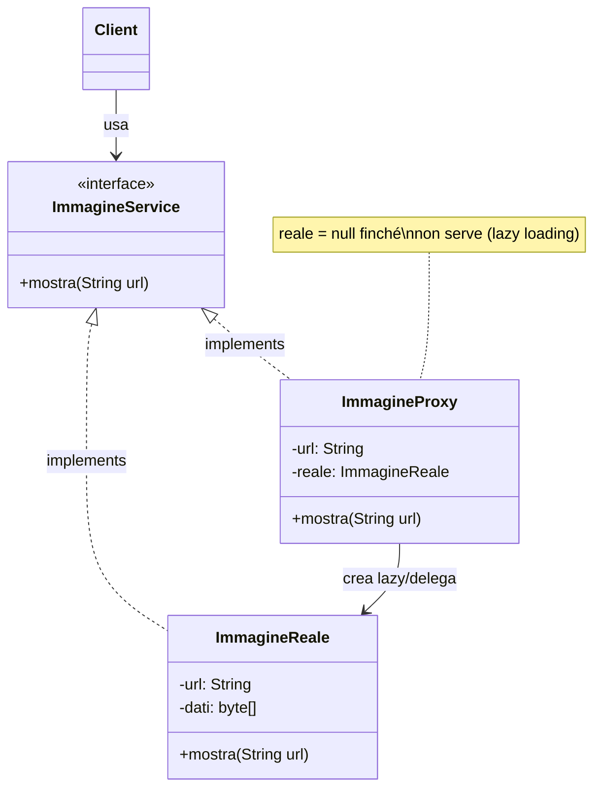
```mermaid
classDiagram
    class ImmagineService {
        <<interface>>
        +mostra(String url)
    }
    class ImmagineReale {
        -url: String
        -dati: byte[]
        +mostra(String url)
    }
    class ImmagineProxy {
        -url: String
        -reale: ImmagineReale
        +mostra(String url)
    }
    class Client
    ImmagineService <|.. ImmagineReale : implements
    ImmagineService <|.. ImmagineProxy : implements
    ImmagineProxy --> ImmagineReale : crea lazy/delega
    Client --> ImmagineService : usa
    note for ImmagineProxy "reale = null finché\nnon serve (lazy loading)"
```

#### Esempio Java

```java
interface ImmagineService { void mostra(String url); }

class ImmagineReale implements ImmagineService {
    ImmagineReale(String url) { System.out.println("[RETE] Carico: " + url); }
    public void mostra(String url) { System.out.println("[SCHERMO] Mostro: " + url); }
}

class ImmagineProxy implements ImmagineService {
    private final String url;
    private ImmagineReale reale; // null finché non serve

    ImmagineProxy(String url) { this.url = url; }

    public void mostra(String url) {
        if (reale == null) reale = new ImmagineReale(url); // carica SOLO quando serve
        reale.mostra(url);
    }
}

ImmagineService img = new ImmagineProxy("foto.jpg");
System.out.println("Proxy creato — rete non ancora usata");
img.mostra("foto.jpg"); // ora carica
img.mostra("foto.jpg"); // usa l'istanza già caricata
```

#### Pro / Contro

| PRO | CONTRO |
|-----|--------|
| Lazy loading trasparente al client | Può introdurre latenza |
| Logging/caching/sicurezza senza modificare il Real Subject | Codice più complesso |

#### Relazioni con altri pattern

- **vs Decorator** — struttura identica; Proxy controlla accesso, Decorator aggiunge funzionalità
- **vs Adapter** — Adapter cambia l'interfaccia; Proxy la mantiene uguale
- **vs Facade** — Facade semplifica; Proxy intermedia sulla stessa interfaccia

---

## PATTERN COMPORTAMENTALI

> Gestiscono **come gli oggetti comunicano e collaborano** tra loro.

---

### 13. Interpreter

**Categoria:** Comportamentale — Classe  
**Intento:** Definisce una grammatica e un interprete per valutare frasi in quella lingua.

#### Spiegazione per principianti

Un calcolatore valuta `(3 + 4) * 2`. Costruisce un albero: radice = moltiplicazione, figlio sinistro = addizione(3,4), figlio destro = 2. Per calcolare: chiede alla radice di interpretarsi — ricorsione.

#### Diagramma UML

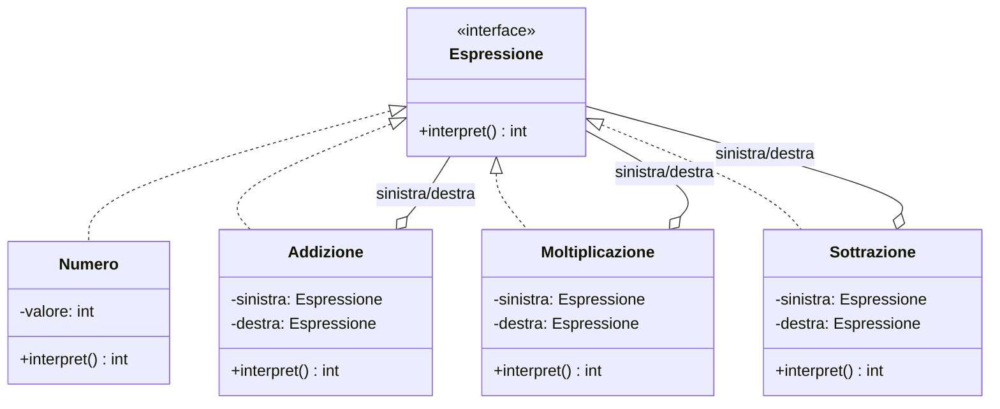
```mermaid
classDiagram
    class Espressione {
        <<interface>>
        +interpret() int
    }
    class Numero {
        -valore: int
        +interpret() int
    }
    class Addizione {
        -sinistra: Espressione
        -destra: Espressione
        +interpret() int
    }
    class Moltiplicazione {
        -sinistra: Espressione
        -destra: Espressione
        +interpret() int
    }
    class Sottrazione {
        -sinistra: Espressione
        -destra: Espressione
        +interpret() int
    }
    Espressione <|.. Numero
    Espressione <|.. Addizione
    Espressione <|.. Moltiplicazione
    Espressione <|.. Sottrazione
    Addizione o-- Espressione : sinistra/destra
    Moltiplicazione o-- Espressione : sinistra/destra
    Sottrazione o-- Espressione : sinistra/destra
```

#### Esempio Java

```java
interface Espressione { int interpret(); }

class Numero        implements Espressione { private final int v; Numero(int v){this.v=v;} public int interpret(){return v;} }
class Addizione     implements Espressione { private final Espressione s,d; Addizione(Espressione s,Espressione d){this.s=s;this.d=d;} public int interpret(){return s.interpret()+d.interpret();} }
class Moltiplicazione implements Espressione { private final Espressione s,d; Moltiplicazione(Espressione s,Espressione d){this.s=s;this.d=d;} public int interpret(){return s.interpret()*d.interpret();} }

// Valuta "(3 + 4) * 2"
Espressione expr = new Moltiplicazione(
    new Addizione(new Numero(3), new Numero(4)),
    new Numero(2)
);
System.out.println(expr.interpret()); // 14
```

#### Pro / Contro

| PRO | CONTRO |
|-----|--------|
| Grammatica facile da estendere | Grammatiche complesse → classi esplosive |
| Ogni regola = una classe | Per linguaggi reali, meglio ANTLR o JavaCC |

#### Relazioni con altri pattern

- **Con Composite** — l'AST è un Composite (espressioni non-terminali contengono altre espressioni)
- **Con Visitor** — il Visitor esegue operazioni diverse sullo stesso AST
- **Con Flyweight** — i nodi terminali possono essere condivisi

---

### 14. Template Method

**Categoria:** Comportamentale — Classe  
**Intento:** Definisce lo **scheletro di un algoritmo** nella classe padre; le sottoclassi ridefiniscono certi passi senza cambiare la struttura.

#### Spiegazione per principianti

Ricetta: *"bollire acqua → aggiungere ingrediente → versare"*. La struttura è sempre la stessa. Il tè mette la bustina, il caffè mette la polvere. Il *template* non cambia.

#### Diagramma UML

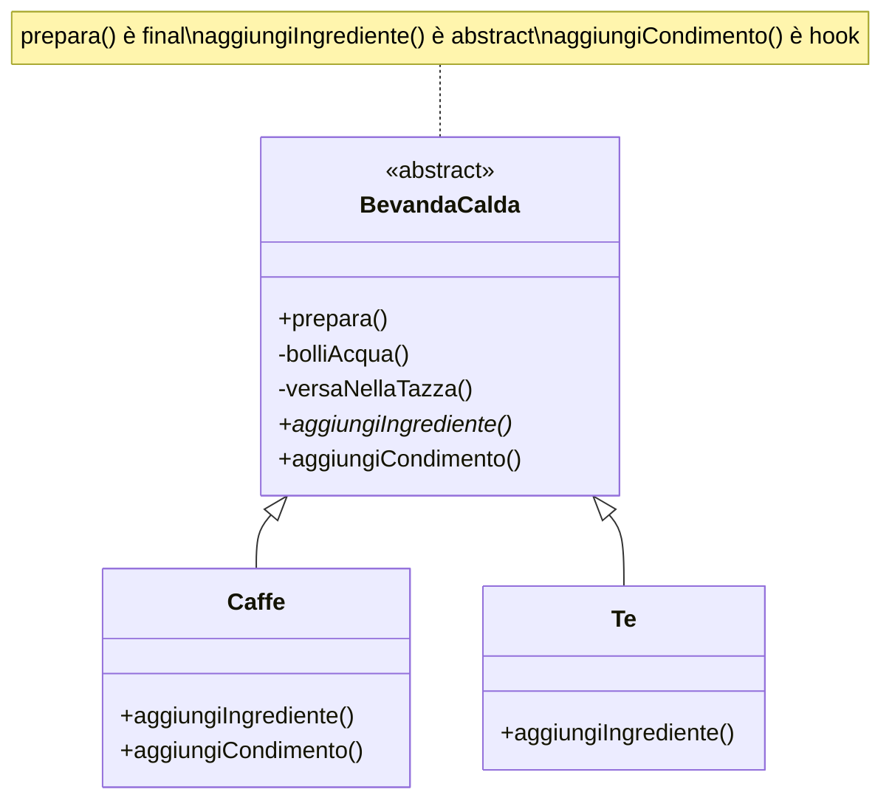
```mermaid
classDiagram
    class BevandaCalda {
        <<abstract>>
        +prepara()
        -bolliAcqua()
        -versaNellaTazza()
        +aggiungiIngrediente()*
        +aggiungiCondimento()
    }
    class Caffe {
        +aggiungiIngrediente()
        +aggiungiCondimento()
    }
    class Te {
        +aggiungiIngrediente()
    }
    BevandaCalda <|-- Caffe
    BevandaCalda <|-- Te
    note for BevandaCalda "prepara() è final\naggiungiIngrediente() è abstract\naggiungiCondimento() è hook"
```

#### Esempio Java

```java
abstract class BevandaCalda {
    public final void prepara() {      // TEMPLATE METHOD — final
        bolliAcqua();
        aggiungiIngrediente();         // abstract — obbligatorio
        versaNellaTazza();
        aggiungiCondimento();          // hook — opzionale
    }
    private void bolliAcqua()      { System.out.println("Bollo l'acqua"); }
    private void versaNellaTazza() { System.out.println("Verso nella tazza"); }
    protected abstract void aggiungiIngrediente();
    protected void aggiungiCondimento() {} // hook con default vuoto
}

class Caffe extends BevandaCalda {
    protected void aggiungiIngrediente() { System.out.println("Aggiungo caffe'"); }
    protected void aggiungiCondimento()  { System.out.println("Aggiungo zucchero"); }
}
class Te extends BevandaCalda {
    protected void aggiungiIngrediente() { System.out.println("Metto la bustina"); }
    // non sovrascrive aggiungiCondimento -> nessun condimento
}

new Caffe().prepara();
```

#### Pro / Contro

| PRO | CONTRE |
|-----|--------|
| Evita duplicazione della struttura algoritmo | Più rigido di Strategy (usa ereditarietà) |
| Hollywood Principle: il framework controlla il flusso | |

#### Relazioni con altri pattern

- **vs Strategy** — Template usa *ereditarietà* (statico); Strategy usa *composizione* (dinamico). Preferisci Strategy quando possibile.
- **Factory Method è un Template Method** — applicato alla creazione di oggetti

---

### 15. Chain of Responsibility

**Categoria:** Comportamentale — Oggetto  
**Intento:** Passa una richiesta lungo una catena di handler finché uno la gestisce.

#### Spiegazione per principianti

Supporto clienti: prima risponde il bot, poi l'operatore base, poi il tecnico specializzato. Ogni livello conosce solo il successivo.

#### Diagramma UML

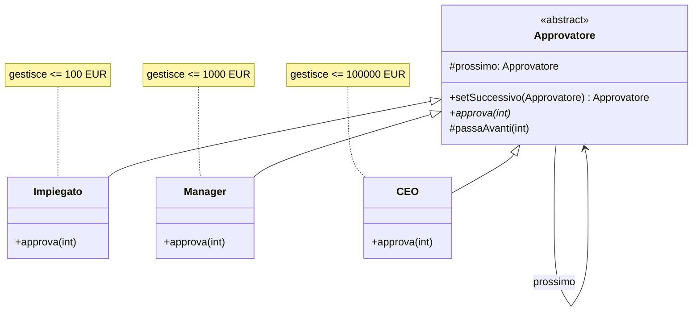
```mermaid
classDiagram
    class Approvatore {
        <<abstract>>
        #prossimo: Approvatore
        +setSuccessivo(Approvatore) Approvatore
        +approva(int)*
        #passaAvanti(int)
    }
    class Impiegato {
        +approva(int)
    }
    class Manager {
        +approva(int)
    }
    class CEO {
        +approva(int)
    }
    Approvatore <|-- Impiegato
    Approvatore <|-- Manager
    Approvatore <|-- CEO
    Approvatore --> Approvatore : prossimo
    note for Impiegato "gestisce <= 100 EUR"
    note for Manager "gestisce <= 1000 EUR"
    note for CEO "gestisce <= 100000 EUR"
```

#### Esempio Java

```java
abstract class Approvatore {
    protected Approvatore prossimo;
    public Approvatore setSuccessivo(Approvatore p) { prossimo = p; return p; }
    public abstract void approva(int importo);
    protected void passaAvanti(int i) {
        if (prossimo != null) prossimo.approva(i);
        else System.out.println("Nessuno puo' approvare " + i + " EUR");
    }
}
class Impiegato extends Approvatore { public void approva(int i) { if(i<=100) System.out.println("Impiegato OK "+i); else passaAvanti(i); } }
class Manager   extends Approvatore { public void approva(int i) { if(i<=1000) System.out.println("Manager OK "+i); else passaAvanti(i); } }
class CEO       extends Approvatore { public void approva(int i) { if(i<=100000) System.out.println("CEO OK "+i); else passaAvanti(i); } }

Approvatore imp = new Impiegato();
imp.setSuccessivo(new Manager()).setSuccessivo(new CEO());

imp.approva(50);     // Impiegato OK
imp.approva(700);    // Manager OK
imp.approva(80000);  // CEO OK
imp.approva(200000); // Nessuno puo' approvare
```

#### Pro / Contro

| PRO | CONTRO |
|-----|--------|
| Disaccoppia mittente e ricevitore | Nessuna garanzia che la richiesta venga gestita |
| Open/Closed per aggiungere handler | Difficile debuggare |

#### Relazioni con altri pattern

- **Con Command** — la richiesta può essere incapsulata come Command
- **vs Observer** — Observer notifica *tutti*; CoR passa finché *uno* gestisce
- **Simile a Decorator** — Decorator modifica sempre; CoR decide chi risponde

---

### 16. Command

**Categoria:** Comportamentale — Oggetto  
**Intento:** Incapsula una **richiesta come oggetto** — supporta undo, queue, log.

#### Spiegazione per principianti

Ogni tasto del telecomando è un "comando" incapsulato. Non sai come il TV implementa "accendi" — premi il tasto. Puoi memorizzare la sequenza di tasti e "annullare" l'ultimo.

#### Diagramma UML

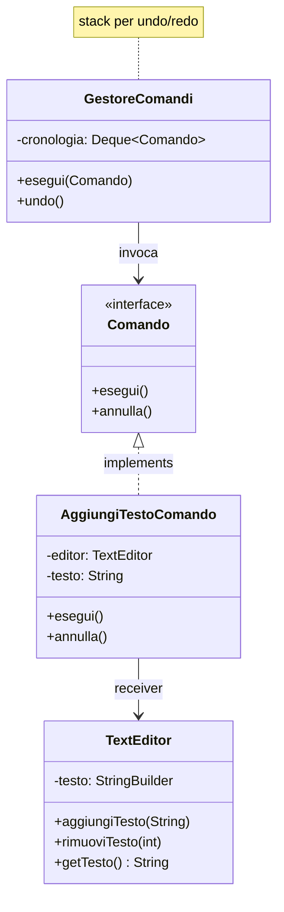
```mermaid
classDiagram
    class Comando {
        <<interface>>
        +esegui()
        +annulla()
    }
    class AggiungiTestoComando {
        -editor: TextEditor
        -testo: String
        +esegui()
        +annulla()
    }
    class GestoreComandi {
        -cronologia: Deque~Comando~
        +esegui(Comando)
        +undo()
    }
    class TextEditor {
        -testo: StringBuilder
        +aggiungiTesto(String)
        +rimuoviTesto(int)
        +getTesto() String
    }
    Comando <|.. AggiungiTestoComando : implements
    AggiungiTestoComando --> TextEditor : receiver
    GestoreComandi --> Comando : invoca
    note for GestoreComandi "stack per undo/redo"
```

#### Esempio Java

```java
interface Comando { void esegui(); void annulla(); }

class TextEditor {
    private StringBuilder testo = new StringBuilder();
    void aggiungiTesto(String t)  { testo.append(t); }
    void rimuoviTesto(int length) { if(testo.length()>=length) testo.delete(testo.length()-length, testo.length()); }
    String getTesto()             { return testo.toString(); }
}

class AggiungiTestoComando implements Comando {
    private final TextEditor e; private final String t;
    AggiungiTestoComando(TextEditor e, String t) { this.e=e; this.t=t; }
    public void esegui()  { e.aggiungiTesto(t); }
    public void annulla() { e.rimuoviTesto(t.length()); }
}

class GestoreComandi {
    private final Deque<Comando> stack = new ArrayDeque<>();
    void esegui(Comando c) { c.esegui(); stack.push(c); }
    void undo()            { if(!stack.isEmpty()) stack.pop().annulla(); }
}

// Uso
TextEditor ed = new TextEditor();
GestoreComandi g = new GestoreComandi();
g.esegui(new AggiungiTestoComando(ed, "Hello "));
g.esegui(new AggiungiTestoComando(ed, "World"));
System.out.println(ed.getTesto()); // "Hello World"
g.undo();
System.out.println(ed.getTesto()); // "Hello "
```

#### Pro / Contro

| PRO | CONTRO |
|-----|--------|
| Undo/Redo semplice | Molte classi per operazioni semplici |
| Comandi accodabili, loggabili, serializzabili | |

#### Relazioni con altri pattern

- **vs Strategy** — Command = azione + undo + metadati; Strategy = scelta algoritmo
- **Con Memento** — Command usa Memento per undo complessi
- **Con Composite** — Macro-Command = Composite di Command

---

### 17. Iterator

**Categoria:** Comportamentale — Oggetto  
**Intento:** Accede sequenzialmente agli elementi di un aggregato **senza esporne la struttura interna**.

#### Spiegazione per principianti

Playlist musicale. Non ti importa come sono memorizzate le canzoni — vuoi solo "avanti". L'iteratore nasconde l'implementazione interna.

#### Diagramma UML

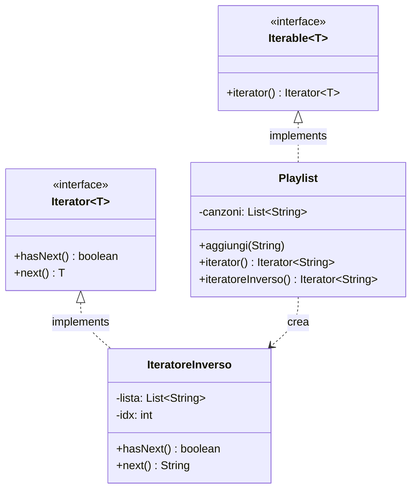
```mermaid
classDiagram
    class Iterable~T~ {
        <<interface>>
        +iterator() Iterator~T~
    }
    class Iterator~T~ {
        <<interface>>
        +hasNext() boolean
        +next() T
    }
    class Playlist {
        -canzoni: List~String~
        +aggiungi(String)
        +iterator() Iterator~String~
        +iteratoreInverso() Iterator~String~
    }
    class IteratoreInverso {
        -lista: List~String~
        -idx: int
        +hasNext() boolean
        +next() String
    }
    Iterable <|.. Playlist : implements
    Iterator <|.. IteratoreInverso : implements
    Playlist ..> IteratoreInverso : crea
```

#### Esempio Java

```java
class Playlist implements Iterable<String> {
    private final List<String> canzoni = new ArrayList<>();
    void aggiungi(String s) { canzoni.add(s); }

    @Override public Iterator<String> iterator() { return canzoni.iterator(); }

    Iterator<String> iteratoreInverso() {
        return new Iterator<>() {
            private int idx = canzoni.size() - 1;
            public boolean hasNext() { return idx >= 0; }
            public String  next()    { return canzoni.get(idx--); }
        };
    }
}

Playlist p = new Playlist();
p.aggiungi("A"); p.aggiungi("B"); p.aggiungi("C");

for (String s : p)                    System.out.print(s + " "); // A B C
Iterator<String> inv = p.iteratoreInverso();
while (inv.hasNext()) System.out.print(inv.next() + " ");        // C B A
```

#### Pro / Contro

| PRO | CONTRO |
|-----|--------|
| Nasconde l'implementazione interna | Overhead per strutture semplici |
| Open/Closed: nuovi iteratori senza toccare l'aggregato | |

#### Relazioni con altri pattern

- **Con Composite** — per navigare la struttura ad albero
- **Con Visitor** — Visitor usa Iterator per attraversare gli elementi
- **Factory Method** — `createIterator()` è un Factory Method

---

### 18. Mediator

**Categoria:** Comportamentale — Oggetto  
**Intento:** Centralizza la comunicazione tra oggetti, riducendo l'accoppiamento da O(N²) a O(N).

#### Spiegazione per principianti

Torre di controllo aeroporto: gli aerei non si parlano direttamente. Tutti comunicano solo con la torre, che coordina chi atterra, chi decolla, chi aspetta.

#### Diagramma UML

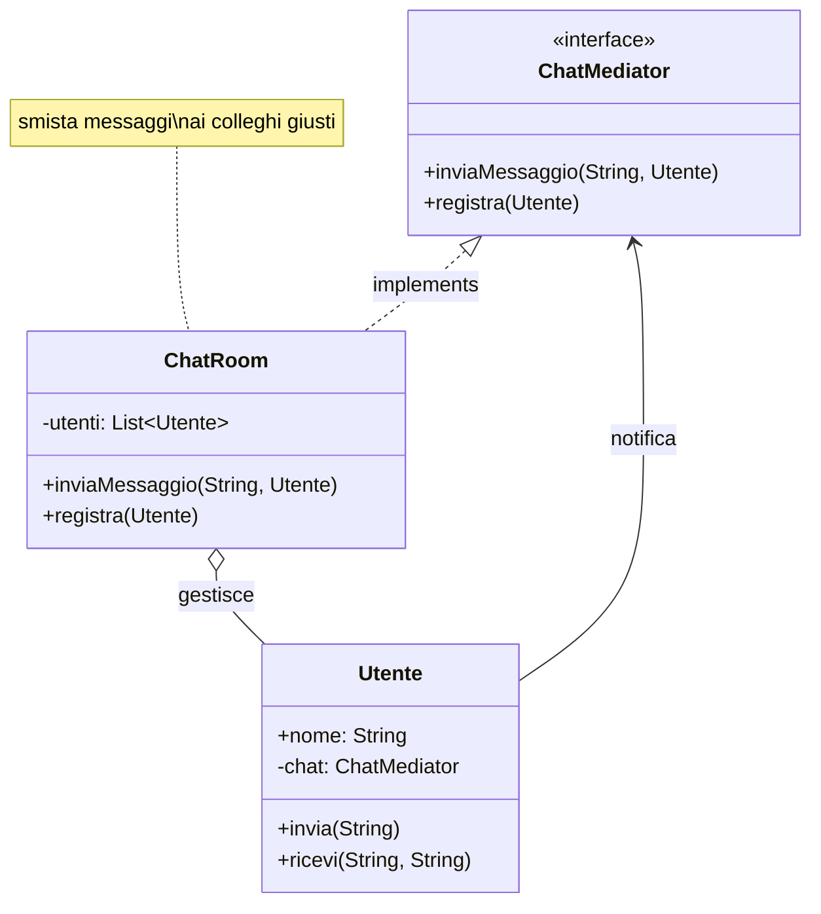
```mermaid
classDiagram
    class ChatMediator {
        <<interface>>
        +inviaMessaggio(String, Utente)
        +registra(Utente)
    }
    class ChatRoom {
        -utenti: List~Utente~
        +inviaMessaggio(String, Utente)
        +registra(Utente)
    }
    class Utente {
        +nome: String
        -chat: ChatMediator
        +invia(String)
        +ricevi(String, String)
    }
    ChatMediator <|.. ChatRoom : implements
    Utente --> ChatMediator : notifica
    ChatRoom o-- Utente : gestisce
    note for ChatRoom "smista messaggi\nai colleghi giusti"
```

#### Esempio Java

```java
interface ChatMediator { void inviaMessaggio(String msg, Utente mittente); void registra(Utente u); }

class Utente {
    final String nome; private final ChatMediator chat;
    Utente(String nome, ChatMediator chat) { this.nome=nome; this.chat=chat; chat.registra(this); }
    void invia(String msg)               { System.out.println(nome+": "+msg); chat.inviaMessaggio(msg, this); }
    void ricevi(String msg, String da)   { System.out.println("  -> "+nome+" da "+da+": "+msg); }
}

class ChatRoom implements ChatMediator {
    private final List<Utente> utenti = new ArrayList<>();
    public void registra(Utente u)                              { utenti.add(u); }
    public void inviaMessaggio(String msg, Utente mittente)     { utenti.stream().filter(u->u!=mittente).forEach(u->u.ricevi(msg, mittente.nome)); }
}

ChatMediator chat = new ChatRoom();
Utente alice = new Utente("Alice", chat);
Utente bob   = new Utente("Bob",   chat);
alice.invia("Ciao!"); // Bob riceve, Alice no
```

#### Pro / Contro

| PRO | CONTRE |
|-----|--------|
| Riduce accoppiamento O(N²) → O(N) | Il Mediator può diventare un god object |
| Facile aggiungere nuovi colleghi | |

#### Relazioni con altri pattern

- **vs Facade** — Facade semplifica un sottosistema; Mediator coordina oggetti pari
- **vs Observer** — Observer = uno-a-molti; Mediator = molti-a-molti centralizzato
- **Con Observer** — il Mediator usa spesso Observer per notificare i colleghi

---

### 19. Memento

**Categoria:** Comportamentale — Oggetto  
**Intento:** Cattura e ripristina lo **stato interno** di un oggetto senza violare l'incapsulamento.

#### Spiegazione per principianti

Il tasto *"Salva partita"*: salvi (snapshot), giochi, perdi, carichi. Il file di salvataggio (Memento) è opaco per chi lo conserva — solo il gioco sa leggerlo.

#### Diagramma UML

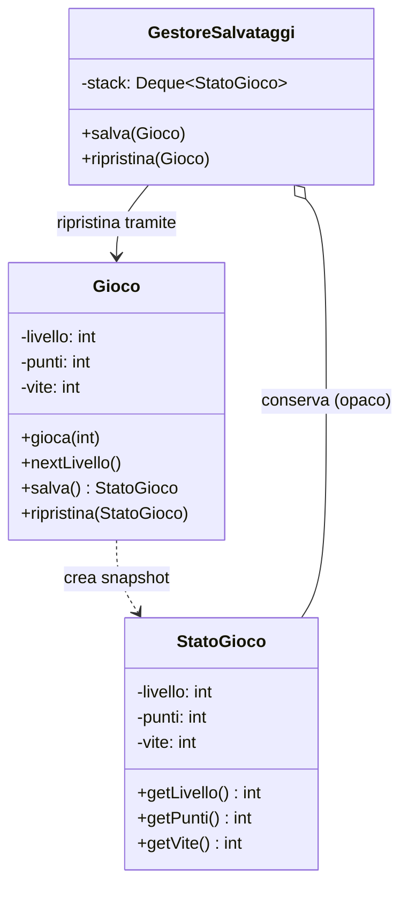
```mermaid
classDiagram
    class Gioco {
        -livello: int
        -punti: int
        -vite: int
        +gioca(int)
        +nextLivello()
        +salva() StatoGioco
        +ripristina(StatoGioco)
    }
    class StatoGioco {
        -livello: int
        -punti: int
        -vite: int
        +getLivello() int
        +getPunti() int
        +getVite() int
    }
    class GestoreSalvataggi {
        -stack: Deque~StatoGioco~
        +salva(Gioco)
        +ripristina(Gioco)
    }
    Gioco ..> StatoGioco : crea snapshot
    GestoreSalvataggi o-- StatoGioco : conserva (opaco)
    GestoreSalvataggi --> Gioco : ripristina tramite
```

#### Esempio Java

```java
class StatoGioco { // Memento immutabile
    private final int livello, punti, vite;
    StatoGioco(int l, int p, int v) { livello=l; punti=p; vite=v; }
    int getLivello(){return livello;} int getPunti(){return punti;} int getVite(){return vite;}
}

class Gioco { // Originator
    private int livello=1, punti=0, vite=3;
    void gioca(int p)         { punti+=p; System.out.println("punti="+punti); }
    void nextLivello()        { livello++; System.out.println("Livello "+livello); }
    StatoGioco salva()        { return new StatoGioco(livello, punti, vite); }
    void ripristina(StatoGioco s) { livello=s.getLivello(); punti=s.getPunti(); vite=s.getVite(); System.out.println("Ripristinato lvl="+livello+" pts="+punti); }
}

class GestoreSalvataggi { // Caretaker
    private final Deque<StatoGioco> stack = new ArrayDeque<>();
    void salva(Gioco g)      { stack.push(g.salva()); }
    void ripristina(Gioco g) { if(!stack.isEmpty()) g.ripristina(stack.pop()); }
}

Gioco g = new Gioco(); GestoreSalvataggi sv = new GestoreSalvataggi();
sv.salva(g); g.gioca(100); g.nextLivello(); sv.salva(g);
g.gioca(200); System.out.println("Game Over!");
sv.ripristina(g); // torna al checkpoint 2
```

#### Pro / Contro

| PRO | CONTRO |
|-----|--------|
| Rispetta l'incapsulamento | Molti Memento = alta memoria |
| Semplifica l'Originator | Il Caretaker non può ottimizzare |

#### Relazioni con altri pattern

- **Con Command** — Command usa Memento per salvare lo stato prima dell'esecuzione → undo
- **vs Prototype** — Prototype clona l'intero oggetto; Memento salva solo lo stato

---

### 20. Flyweight

> **Nota classificazione GoF:** Flyweight è **Strutturale** nel libro originale, non Comportamentale.

**Categoria:** Strutturale — Oggetto  
**Intento:** Usa la **condivisione** per supportare efficientemente grandi quantità di oggetti simili.

#### Cos'è e a cosa serve

Separa lo stato **intrinseco** (condiviso, immutabile) dallo stato **estrinseco** (unico per istanza, passato come parametro). Un pool condivide gli oggetti intrinseci.

#### Spiegazione per principianti

La lettera "A" in un libro appare migliaia di volte. Crea **un solo oggetto** "A" (font, dimensione = stato intrinseco) e passagli ogni volta la posizione nella pagina (stato estrinseco). 1 oggetto invece di migliaia.

#### Diagramma UML

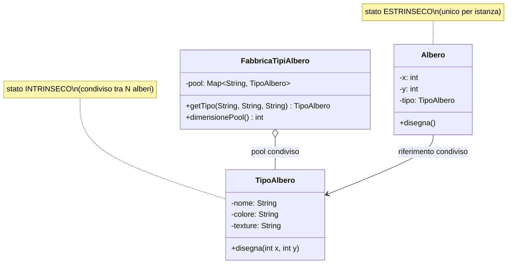
```mermaid
classDiagram
    class TipoAlbero {
        -nome: String
        -colore: String
        -texture: String
        +disegna(int x, int y)
    }
    class FabbricaTipiAlbero {
        -pool: Map~String, TipoAlbero~
        +getTipo(String, String, String) TipoAlbero
        +dimensionePool() int
    }
    class Albero {
        -x: int
        -y: int
        -tipo: TipoAlbero
        +disegna()
    }
    FabbricaTipiAlbero o-- TipoAlbero : pool condiviso
    Albero --> TipoAlbero : riferimento condiviso
    note for TipoAlbero "stato INTRINSECO\n(condiviso tra N alberi)"
    note for Albero "stato ESTRINSECO\n(unico per istanza)"
```

#### Esempio Java

```java
class TipoAlbero { // Flyweight — solo stato intrinseco
    private final String nome, colore, texture;
    TipoAlbero(String n, String c, String t) { nome=n; colore=c; texture=t; System.out.println("Creato tipo: "+n); }
    void disegna(int x, int y) { System.out.printf("Disegno %s a (%d,%d)%n", nome, x, y); }
}

class FabbricaTipiAlbero { // Flyweight Factory
    private final Map<String, TipoAlbero> pool = new HashMap<>();
    TipoAlbero getTipo(String nome, String colore, String texture) {
        return pool.computeIfAbsent(nome+"_"+colore, k -> new TipoAlbero(nome, colore, texture));
    }
}

class Albero { // Context — stato estrinseco
    private final int x, y; private final TipoAlbero tipo;
    Albero(int x, int y, TipoAlbero t) { this.x=x; this.y=y; tipo=t; }
    void disegna() { tipo.disegna(x, y); }
}

FabbricaTipiAlbero fab = new FabbricaTipiAlbero();
List<Albero> foresta = new ArrayList<>();
for (int i = 0; i < 1_000_000; i++) {
    foresta.add(new Albero(i*5, i*3, fab.getTipo(i%2==0?"Quercia":"Pino","Verde","bark")));
}
System.out.println("Tipi in RAM: " + fab.dimensionePool()); // 2 invece di 1.000.000!
```

#### Pro / Contro

| PRO | CONTRO |
|-----|--------|
| Riduce drasticamente il consumo di memoria | Codice più complesso (separazione intrinseco/estrinseco) |
| | Non adatto se gli oggetti differiscono molto |

#### Relazioni con altri pattern

- **Con Composite** — Flyweight implementa i nodi foglia condivisi
- **vs Singleton** — Singleton = 1 istanza; Flyweight = 1 per tipo

---

### 21. Observer

**Categoria:** Comportamentale — Oggetto  
**Intento:** Definisce una dipendenza **uno-a-molti**: al cambio di stato del Subject, tutti gli Observer vengono notificati automaticamente.

#### Spiegazione per principianti

Canale YouTube: ti iscrivi. Quando il creatore pubblica, **tutti gli iscritti** ricevono la notifica. Il creatore non sa chi sono — manda solo il segnale. Ogni iscritto decide cosa farne.

#### Diagramma UML

```mermaid
classDiagram
    class Osservatore {
        <<interface>>
        +aggiorna(String evento, Object dato)
    }
    class BorsaValori {
        -osservatori: List~Osservatore~
        -prezzi: Map~String,Double~
        +iscriviti(Osservatore)
        +disiscriviti(Osservatore)
        +aggiornaPrezio(String, double)
        -notifica(String, Object)
    }
    class Investitore {
        -nome: String
        +aggiorna(String, Object)
    }
    class AlertBot {
        +aggiorna(String, Object)
    }
    Osservatore <|.. Investitore : implements
    Osservatore <|.. AlertBot : implements
    BorsaValori o-- Osservatore : notifica 0..*
```

#### Esempio Java

```java
interface Osservatore { void aggiorna(String evento, Object dato); }

class BorsaValori {
    private final List<Osservatore> obs = new ArrayList<>();
    void iscriviti(Osservatore o)    { obs.add(o); }
    void disiscriviti(Osservatore o) { obs.remove(o); }
    void aggiornaPrezio(String az, double p) { notifica("CAMBIO", az+"="+p); }
    private void notifica(String ev, Object d) { obs.forEach(o -> o.aggiorna(ev, d)); }
}

class Investitore implements Osservatore {
    private final String nome;
    Investitore(String n) { nome=n; }
    public void aggiorna(String ev, Object d) { System.out.println(nome+" riceve: "+d); }
}

BorsaValori borsa = new BorsaValori();
borsa.iscriviti(new Investitore("Alice"));
borsa.iscriviti(new Investitore("Bob"));
borsa.aggiornaPrezio("AAPL", 175.0); // Alice e Bob ricevono entrambi
```

#### Pro / Contro

| PRO | CONTRO |
|-----|--------|
| Open/Closed: aggiungi Observer senza toccare il Subject | Memory leak se dimentichi disiscriviti |
| Loose coupling | Catene di notifiche difficili da debuggare |

#### Relazioni con altri pattern

- **vs Mediator** — Observer = uno-a-molti; Mediator = molti-a-molti centralizzato
- **→ Reactive** — Observer è la base di RxJava, Reactor
- **vs Chain of Responsibility** — Observer notifica *tutti*; CoR passa finché *uno* gestisce

---

### 22. State

**Categoria:** Comportamentale — Oggetto  
**Intento:** L'oggetto **cambia comportamento** al cambiare del suo stato interno — come se cambiasse classe.

#### Spiegazione per principianti

Semaforo: tre stati (Rosso, Giallo, Verde). "Cambia luce" fa cose diverse a seconda dello stato corrente. Senza State: un enorme if-else. Con State: ogni stato *sa* dove andare.

#### Diagramma UML

```mermaid
classDiagram
    class Ordine {
        -stato: StatoOrdine
        +setState(StatoOrdine)
        +paga()
        +spedisci()
        +consegna()
        +getStato() String
    }
    class StatoOrdine {
        <<interface>>
        +paga(Ordine)
        +spedisci(Ordine)
        +consegna(Ordine)
        +nome() String
    }
    class StatoInAttesa {
        +paga(Ordine)
        +spedisci(Ordine)
        +consegna(Ordine)
        +nome() String
    }
    class StatoPagato {
        +paga(Ordine)
        +spedisci(Ordine)
        +consegna(Ordine)
        +nome() String
    }
    class StatoSpedito {
        +paga(Ordine)
        +spedisci(Ordine)
        +consegna(Ordine)
        +nome() String
    }
    class StatoConsegnato {
        +paga(Ordine)
        +spedisci(Ordine)
        +consegna(Ordine)
        +nome() String
    }
    StatoOrdine <|.. StatoInAttesa
    StatoOrdine <|.. StatoPagato
    StatoOrdine <|.. StatoSpedito
    StatoOrdine <|.. StatoConsegnato
    Ordine --> StatoOrdine : stato corrente
    StatoInAttesa ..> StatoPagato : transizione
    StatoPagato ..> StatoSpedito : transizione
    StatoSpedito ..> StatoConsegnato : transizione
```

#### Esempio Java

```java
interface StatoOrdine { void paga(Ordine o); void spedisci(Ordine o); void consegna(Ordine o); String nome(); }

class Ordine {
    private StatoOrdine stato = new StatoInAttesa();
    void setState(StatoOrdine s) { stato = s; }
    void paga()     { stato.paga(this); }
    void spedisci() { stato.spedisci(this); }
    void consegna() { stato.consegna(this); }
    String getStato() { return stato.nome(); }
}

class StatoInAttesa implements StatoOrdine {
    public void paga(Ordine o)     { System.out.println("Pagato!"); o.setState(new StatoPagato()); }
    public void spedisci(Ordine o) { System.out.println("Errore: paga prima!"); }
    public void consegna(Ordine o) { System.out.println("Errore: non spedito!"); }
    public String nome()           { return "IN_ATTESA"; }
}
class StatoPagato implements StatoOrdine {
    public void paga(Ordine o)     { System.out.println("Gia' pagato!"); }
    public void spedisci(Ordine o) { System.out.println("Spedito!"); o.setState(new StatoSpedito()); }
    public void consegna(Ordine o) { System.out.println("Errore: spedisci prima!"); }
    public String nome()           { return "PAGATO"; }
}
class StatoSpedito implements StatoOrdine {
    public void paga(Ordine o)     { System.out.println("Gia' pagato!"); }
    public void spedisci(Ordine o) { System.out.println("Gia' spedito!"); }
    public void consegna(Ordine o) { System.out.println("Consegnato!"); o.setState(new StatoConsegnato()); }
    public String nome()           { return "SPEDITO"; }
}
class StatoConsegnato implements StatoOrdine {
    public void paga(Ordine o)     { System.out.println("Ordine chiuso!"); }
    public void spedisci(Ordine o) { System.out.println("Ordine chiuso!"); }
    public void consegna(Ordine o) { System.out.println("Ordine chiuso!"); }
    public String nome()           { return "CONSEGNATO"; }
}

Ordine o = new Ordine();
o.spedisci(); // Errore: paga prima!
o.paga();     // Pagato!
o.spedisci(); // Spedito!
o.consegna(); // Consegnato!
```

#### Pro / Contro

| PRO | CONTRE |
|-----|--------|
| Elimina enormi switch/if-else | Molte classi per FSM semplici |
| Transizioni esplicite e localizzate | Logica distribuita tra gli stati |

#### Relazioni con altri pattern

- **vs Strategy** — struttura *identica*, scopo *diverso*: State fa transizioni autonome (gli stati si conoscono); Strategy è scelta dal client (le strategie sono indipendenti)
- **State implementa FSM** — è la realizzazione OOP di una Finite State Machine
- **Con Singleton** — spesso i singoli stati sono Singleton (nessuno stato interno mutabile)

---

### 23. Strategy

**Categoria:** Comportamentale — Oggetto  
**Intento:** Definisce algoritmi intercambiabili e li rende **sostituibili a runtime**.

#### Spiegazione per principianti

Navigatore GPS: scegli *"percorso più veloce"*, *"più breve"*, *"evita autostrade"*. L'app è la stessa — cambia solo la *strategia* di calcolo.

#### Diagramma UML

```mermaid
classDiagram
    class SortStrategy {
        <<interface>>
        +sort(int[] array)
    }
    class BubbleSort {
        +sort(int[] array)
    }
    class QuickSort {
        +sort(int[] array)
    }
    class MergeSort {
        +sort(int[] array)
    }
    class Sorter {
        -strategy: SortStrategy
        +setStrategy(SortStrategy)
        +sort(int[] array)
    }
    SortStrategy <|.. BubbleSort : implements
    SortStrategy <|.. QuickSort : implements
    SortStrategy <|.. MergeSort : implements
    Sorter --> SortStrategy : usa
    note for Sorter "delega a strategy\ncambiabile a runtime"
```

#### Esempio Java

```java
interface SortStrategy { void sort(int[] array); }

class BubbleSort implements SortStrategy { public void sort(int[] a) { System.out.println("BubbleSort su "+a.length); } }
class QuickSort  implements SortStrategy { public void sort(int[] a) { System.out.println("QuickSort su "+a.length); } }
class MergeSort  implements SortStrategy { public void sort(int[] a) { System.out.println("MergeSort su "+a.length); } }

class Sorter {
    private SortStrategy strategy;
    Sorter(SortStrategy s) { strategy = s; }
    void setStrategy(SortStrategy s) { strategy = s; } // cambio a runtime
    void sort(int[] array) { strategy.sort(array); }
}

int[] dati = {5, 2, 8, 1};
Sorter sorter = new Sorter(new BubbleSort());
sorter.sort(dati); // "BubbleSort su 4"

sorter.setStrategy(new QuickSort());
sorter.sort(dati); // "QuickSort su 4"

// Java 8+: lambda come Strategy inline
sorter.setStrategy(a -> System.out.println("Custom sort su " + a.length));
sorter.sort(dati);
```

#### Pro / Contro

| PRO | CONTRO |
|-----|--------|
| Algoritmi intercambiabili a runtime | Il client deve conoscere le strategie disponibili |
| Elimina grossi if-else | |
| Java 8+: lambda sono Strategy naturali | |

#### Relazioni con altri pattern

- **vs Template Method** — Template = ereditarietà (struttura fissa in padre); Strategy = composizione (algoritmo iniettato). Preferisci Strategy.
- **vs State** — struttura identica, scopo diverso (vedi State)
- **vs Command** — Command = azione + undo; Strategy = scelta algoritmo
- `Comparator`, `Runnable`, `Predicate` in Java sono tutti Strategy

---

### 24. Visitor

**Categoria:** Comportamentale — Oggetto  
**Intento:** Aggiunge **operazioni a una struttura di oggetti** senza modificarne le classi. Usa il double dispatch.

#### Spiegazione per principianti

Museo con sculture, dipinti e installazioni. Il *turista* fotografa, il *critico* valuta, l'*assicuratore* stima il valore. Ogni visitatore fa cose diverse sugli stessi oggetti — senza che gli oggetti cambino.

#### Diagramma UML

```mermaid
classDiagram
    class ReportVisitor {
        <<interface>>
        +visita(Dipendente)
        +visita(Manager)
        +visita(Stagista)
    }
    class StipendioVisitor {
        -totale: double
        +visita(Dipendente)
        +visita(Manager)
        +visita(Stagista)
        +getTotale() double
    }
    class HTMLVisitor {
        -html: StringBuilder
        +visita(Dipendente)
        +visita(Manager)
        +visita(Stagista)
        +getHTML() String
    }
    class Elemento {
        <<interface>>
        +accetta(ReportVisitor)
    }
    class Dipendente {
        +nome: String
        +stipendio: double
        +accetta(ReportVisitor)
    }
    class Manager {
        +nome: String
        +stipendio: double
        +accetta(ReportVisitor)
    }
    class Stagista {
        +nome: String
        +accetta(ReportVisitor)
    }
    ReportVisitor <|.. StipendioVisitor : implements
    ReportVisitor <|.. HTMLVisitor : implements
    Elemento <|.. Dipendente : implements
    Elemento <|.. Manager : implements
    Elemento <|.. Stagista : implements
    Dipendente --> ReportVisitor : accetta → v.visita(this)
    Manager --> ReportVisitor : accetta → v.visita(this)
    Stagista --> ReportVisitor : accetta → v.visita(this)
```

#### Esempio Java

```java
interface ReportVisitor { void visita(Dipendente d); void visita(Manager m); void visita(Stagista s); }
interface Elemento { void accetta(ReportVisitor v); }

class Dipendente implements Elemento { final String nome; final double stipendio; Dipendente(String n,double s){nome=n;stipendio=s;} public void accetta(ReportVisitor v){v.visita(this);} }
class Manager    implements Elemento { final String nome; final double stipendio; Manager(String n,double s){nome=n;stipendio=s;}    public void accetta(ReportVisitor v){v.visita(this);} }
class Stagista   implements Elemento { final String nome;                         Stagista(String n){nome=n;}                         public void accetta(ReportVisitor v){v.visita(this);} }

class StipendioVisitor implements ReportVisitor {
    private double totale = 0;
    public void visita(Dipendente d) { totale += d.stipendio; }
    public void visita(Manager m)    { totale += m.stipendio; }
    public void visita(Stagista s)   { /* non retribuiti */ }
    double getTotale() { return totale; }
}

class HTMLVisitor implements ReportVisitor {
    private final StringBuilder sb = new StringBuilder();
    public void visita(Dipendente d) { sb.append("<li>[D] ").append(d.nome).append("</li>\n"); }
    public void visita(Manager m)    { sb.append("<li>[M] ").append(m.nome).append("</li>\n"); }
    public void visita(Stagista s)   { sb.append("<li>[S] ").append(s.nome).append("</li>\n"); }
    String getHTML() { return "<ul>\n" + sb + "</ul>"; }
}

List<Elemento> org = List.of(new Dipendente("Alice",3000), new Manager("Bob",5000), new Stagista("Charlie"), new Dipendente("Dave",2800));

StipendioVisitor sv = new StipendioVisitor();
org.forEach(e -> e.accetta(sv));
System.out.println("Totale: " + sv.getTotale()); // 10800.0

HTMLVisitor hv = new HTMLVisitor();
org.forEach(e -> e.accetta(hv));
System.out.println(hv.getHTML());
```

#### Pro / Contro

| PRO | CONTRO |
|-----|--------|
| Open/Closed per nuove *operazioni* (aggiungi Visitor, non tocchi Element) | Chiuso per nuovi *tipi di Element* (devi aggiornare tutti i Visitor) |
| Accumula stato durante la visita | Il Visitor accede spesso agli internals degli Element |
| Single Responsibility per ogni Visitor | Double dispatch difficile da capire inizialmente |

#### Relazioni con altri pattern

- **Con Composite** — Visitor opera su strutture Composite
- **Con Iterator** — Iterator attraversa, Visitor definisce cosa fare
- **Con Interpreter** — Visitor esegue operazioni sull'AST creato dall'Interpreter
- **Double Dispatch** — è la soluzione OOP al double dispatch in Java (che supporta solo single dispatch)

---

## Mappa delle Relazioni tra Pattern

```mermaid
graph TD
    subgraph CR["CREAZIONALI"]
        FM[Factory Method]
        AF[Abstract Factory]
        BU[Builder]
        PR[Prototype]
        SN[Singleton]
    end
    subgraph ST["STRUTTURALI"]
        ADA[Adapter]
        BR[Bridge]
        CO[Composite]
        DE[Decorator]
        FA[Facade]
        PX[Proxy]
        FW[Flyweight]
    end
    subgraph BE["COMPORTAMENTALI"]
        IN[Interpreter]
        TM[Template Method]
        CR2[Chain of Resp.]
        CM[Command]
        IT[Iterator]
        ME[Mediator]
        MN[Memento]
        OB[Observer]
        ST2[State]
        STR[Strategy]
        VI[Visitor]
    end

    FM -->|"evolve in"| AF
    AF -->|"usa"| FM
    AF -->|"spesso è"| SN
    FA -->|"spesso è"| SN
    BU -->|"costruisce"| CO
    PR -.->|"alternativa a"| AF

    TM -.->|"statico di"| STR
    ST2 -.->|"struttura identica"| STR
    CM -->|"usa per undo"| MN
    OB -->|"meccanismo di"| ME
    VI -->|"opera su"| CO
    VI -->|"usa"| IT
    IN -->|"struttura"| CO
    CR2 -->|"incapsula con"| CM
    CO -->|"navigato da"| IT
```

---

## Tabella Riassuntiva

| # | Pattern | Categoria GoF | Problema Risolto | Meccanismo Chiave |
|---|---------|---------------|------------------|-------------------|
| 1 | **Factory Method** | Creazionale (Classe) | Creare oggetti senza specificare la classe | Sottoclassi decidono cosa istanziare |
| 2 | **Abstract Factory** | Creazionale (Oggetto) | Famiglie di oggetti correlati e compatibili | Interfaccia con metodi per ogni tipo |
| 3 | **Builder** | Creazionale (Oggetto) | Oggetti complessi passo dopo passo | Costruttore fluente + Director |
| 4 | **Prototype** | Creazionale (Oggetto) | Copie di oggetti senza dipendere dalla classe | Clonazione deep copy |
| 5 | **Singleton** | Creazionale (Oggetto) | Una sola istanza globale | Costruttore privato + getInstance() |
| 6 | **Adapter (Classe)** | Strutturale (Classe) | Interfacce incompatibili via ereditarietà | extends Adaptee + implements Target |
| 7 | **Adapter (Oggetto)** | Strutturale (Oggetto) | Interfacce incompatibili via composizione | Wrappa l'Adaptee |
| 8 | **Bridge** | Strutturale (Oggetto) | Separare astrazione da implementazione | Astrazione con riferimento all'implementazione |
| 9 | **Composite** | Strutturale (Oggetto) | Gerarchie parte-tutto, trattamento uniforme | Struttura ad albero ricorsiva |
| 10 | **Decorator** | Strutturale (Oggetto) | Aggiungere funzionalità dinamicamente | Composizione a cipolla |
| 11 | **Facade** | Strutturale (Oggetto) | Semplificare accesso a sottosistema complesso | Wrapping in interfaccia unica semplice |
| 12 | **Proxy** | Strutturale (Oggetto) | Controllare accesso a un oggetto | Surrogato con la stessa interfaccia |
| 13 | **Interpreter** | Comportamentale (Classe) | Interpretare un linguaggio/grammatica | AST + ricorsione |
| 14 | **Template Method** | Comportamentale (Classe) | Struttura fissa, passi variabili | Ereditarietà — passi abstract in sottoclassi |
| 15 | **Chain of Responsibility** | Comportamentale (Oggetto) | Gestire richieste senza accoppiare mittente/ricevitore | Catena di handler |
| 16 | **Command** | Comportamentale (Oggetto) | Incapsulare operazioni per undo/queue/log | Oggetto-comando con execute() e undo() |
| 17 | **Iterator** | Comportamentale (Oggetto) | Iterare senza esporre struttura interna | Oggetto con hasNext()/next() |
| 18 | **Mediator** | Comportamentale (Oggetto) | Centralizzare comunicazione complessa | Hub centralizzato |
| 19 | **Memento** | Comportamentale (Oggetto) | Salva/ripristina stato senza violare incapsulamento | Snapshot immutabile |
| 20 | **Flyweight** | *Strutturale* (Oggetto) | Ottimizzare memoria con molti oggetti simili | Pool condiviso — stato intrinseco separato |
| 21 | **Observer** | Comportamentale (Oggetto) | Notifiche uno-a-molti automatiche | Subscribe/Notify |
| 22 | **State** | Comportamentale (Oggetto) | Comportamento diverso per ogni stato | FSM OOP — ogni stato è una classe |
| 23 | **Strategy** | Comportamentale (Oggetto) | Algoritmi intercambiabili a runtime | Composizione — algoritmo iniettato |
| 24 | **Visitor** | Comportamentale (Oggetto) | Aggiungere operazioni a strutture esistenti | Double dispatch — accetta/visita |

---

*Basato su "Design Patterns: Elements of Reusable Object-Oriented Software" — Gamma, Helm, Johnson, Vlissides, Addison-Wesley 1994*
